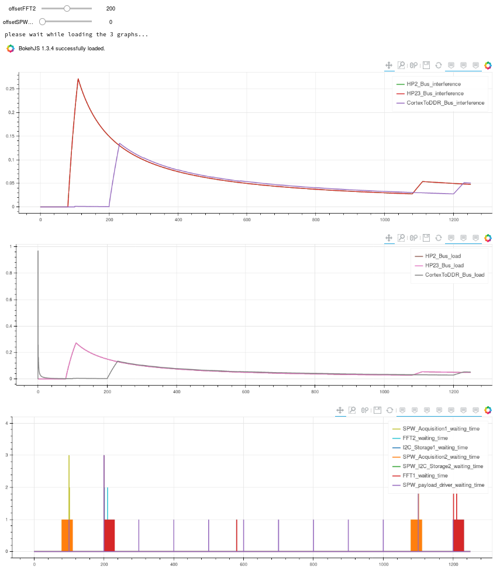
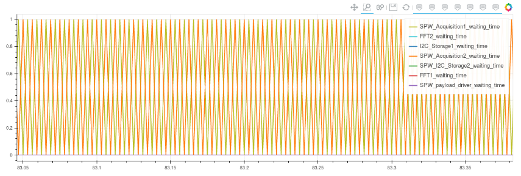

# ERTS2020_artifacts
This is the experiments results and artifacts decribed in the ERTS2020 paper

to play with results, either checkout the repos, install jupyter-notebook (see https://jupyter.readthedocs.io/en/latest/install.html) and run the scripts...

OR

go to binder: https://mybinder.org/v2/gh/jdeantoni/ERTS2020_artifacts/master, please wait while loading... Then
enter one folder, click the .ipynb file.

then, run the three cells and play with the sliders ;)

You Should obtain these kinds of results, showing the bus load, bus intereferences and the waiting time of the different task for their access to a bus:

You can zoon some specific part of the picture. For instance if you zoom a lot on the waiting time where it apears as a single block, you will see the picture below, highlighting the implementation of the LRG policy on the bus

